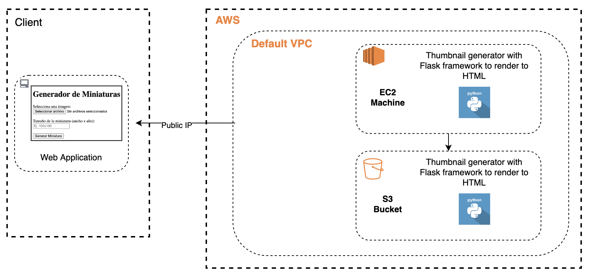
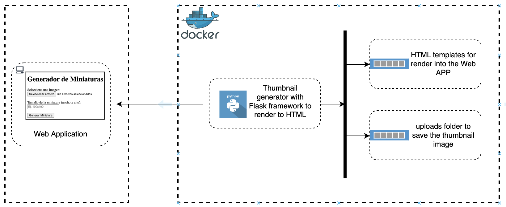

# Thumbnail Generator
This is a Flask application that allows users to generate and serve image thumbnails.


## Features
- Generate thumbnails of images uploaded by users.
- Customize thumbnail size.
- Download generated thumbnails.
- Serve images for visualization.

## Installation
1. Clone the repository:
```bash
git clone https://github.com/JesusGaleana/thumbnail_generator.git
```
2. Go to poject folder in local repository.   

3. Go to AWS console and create a Key Pairs for EC2 instances with the name "keypair-testing"

4. Copy the .pem file into the project folder

5. Create a bucket and EC2 instance with cloudformation, executing:
* Note: For this and the next step is required the AWS cli installed and the Access Key and secret key into ~/.aws/credentials file.
```bash
aws cloudformation create-stack --stack-name stack-test --template-body file://template.yml --capabilities CAPABILITY_IAM
```

6. When the stack was created successfully, update the "deploy.sh" file in the line 7, update the public IP with your instance's public IP
```bash
PUBLIC_IP="your-public-ip"
```

7. Execute the deploy.sh file
```bash
./deploy.sh
```

## Usage
1. Access the application in your browser at public IP assign in EC2 instance
* Example. http://34.219.149.66:5000/
2. Upload an image.
3. Optionally, customize the thumbnail size. Ex. 200x200
4. Click on "Generate Thumbnail" to generate the thumbnail.
5. Download the generated thumbnail or view it in the browser.
6. Now, The thumbnail is in thumbnail-app-bucket in AWS S3, you can also download from there.

## Configuration
Configuration parameters such as upload folder location or HTML templates can be set in the config.yml file.  
This configuration is only for developer.

## Infrastructure
### In Cloud
This application can hosted into cloud services such as AWS, the services and the diagram that could be in the cloud are bellow:  

- EC2: With this cloud computing service we can host the application for thumbnail generator.
- S3: With this cloud storage service we can host the user uploaded images and generated images.

  

### With Docker
This application is  hosted into docker container, you can see the infrastructure diagram bellow:  

  


## License
This project is licensed under the MIT License - see the LICENSE file for details.